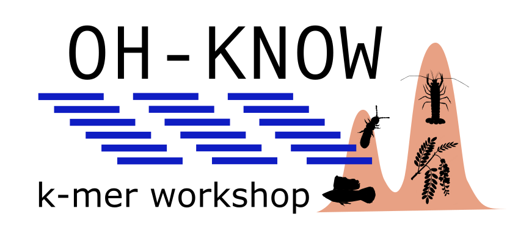

This repository a companion for our paper **Guide to k-mer approaches for genomics across the tree of life** [published in Genome Research](https://genome.cshlp.org/content/35/2/219.full). All the tutorials are on the wiki [here](https://github.com/KamilSJaron/oh-know/wiki). If you will use recommendation in these tutorials, please, do cite the paper.

Our proposal was not selected for journal cover, so we display it at least here:

This repository was used in past for the [oh-know workshop](https://www.forbio.uio.no/events/courses/2021/k-mer_workshop) that took place 13. - 16.9.2021. Therefore the name. Although all the tutorials were updated, you can still find the archived version of the tutorials as taught during the workshop [here](https://github.com/KamilSJaron/oh-know/wiki/_ARCHIVE).

